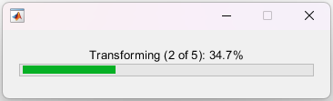
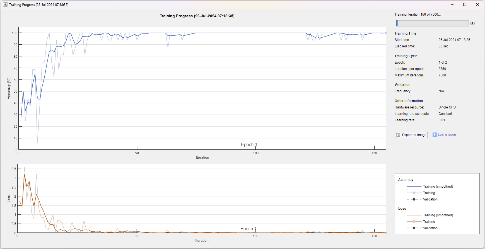

# NuDIT v1.0

## Transforming Numerical Data to Images for Deep Networks.

Brief description of the project, its purpose, and its features.

## Prerequisites

Before you begin, ensure you have met the following requirements:

- **Programming Language:** MATLAB

## Usage

Follow these steps to run the project:

### Phase #1: Initialize the NuDIT

1. **Prepare the Tabular Dataset**

   Tabular datasets in the appropriate format (e.g. csv) should be located in the `TabularDatasets` directory. You can assign the path of a tabular dataset that you want to use to the variable, as shown in the example below.

   ```matlab
   tabularFile = 'TabularDatasets\RiceMSCDataset.csv';

3. **Create an Instance of the NuDIT**

   Initialize the NuDIT object with your dataset file.

   ```matlab
   nudit = NuDIT(tabularFile);

### Phase #2: Transform Numerical Data to Images
During the transformation phase of the tabular dataset, you will see a progress bar as shown below. The duration of this process is directly proportional to the number of records in the tabular dataset. Once the transformation process is complete, the next stage is automatically started.



**Important:** If you have done the transformation process once for a tabular dataset, comment this line of code in subsequent runs. Otherwise, the transformation will be done every time.

1. **Transform numerical data into images suitable for deep learning models.**

   ```matlab
   nudit.numToImgTransform();

### Phase #3: Apply k-fold Cross-Validation
Set Parameters

1. **Define the image size and number of folds for cross-validation. For example, set the image size to 32 pixels and use 5 folds.**

   ```matlab
   imageSize = 32;
   kfold = 5;
   Prepare Data for Cross-Validation

2. **Resize images and split the data into k folds for cross-validation.**

   ```matlab
   nudit.prepareData(imageSize, kfold);

### Phase #4: Run DAG-Net
Train the Network

#### DAG-Net Training Options

The default training options for DAG-Net are as follows:

- **Optimizer:** Stochastic Gradient Descent with Momentum (SGDM)
- **Mini-Batch Size:** 16
- **Maximum Epochs:** `epochs` (variable)
- **Execution Environment:** CPU

Here is an example code snippet showing how the default settings are configured:

   ```matlab
   trainingOptions('sgdm', ...
      'MiniBatchSize', 16, 'MaxEpochs', epochs, 'ExecutionEnvironment', 'cpu');
   ```
These default settings define the core parameters used during the training process of the model. If you wish to customize these training options, you can modify the `trainingOptions` function within the `runNetwork` method of the `NuDIT` class.

1. **Execute the DAG-Net network with a specified number of epochs.**

   ```matlab
   epochs = 10;
   result = nudit.runNetwork(epochs);



### Results
The results (image dataset) will be saved in the `Exports` directory specified in your script. Check this directory for the results and any log files.

### Troubleshooting
If you encounter issues, verify the following:

- The dataset file exists in the `TabularDatasets` directory.
- All necessary packages and toolboxes are installed and properly configured.

### Contributing
For contributions, please follow the guidelines in the CONTRIBUTING.md file.

### License
This project is licensed under the MIT License. See the LICENSE file for more details.

### Contact
For further assistance, please contact:

- **Email:** aelen@bandirma.edu.tr
- **GitHub:** [abdullahelen](https://github.com/abdullahelen)
